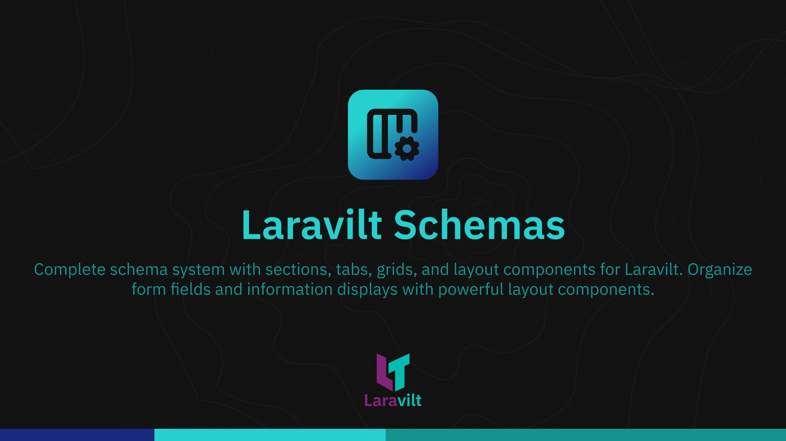

# Schemas Plugin for Laravilt

[](https://packagist.org/packages/laravilt/schemas)
[](https://packagist.org/packages/laravilt/schemas)
[](https://packagist.org/packages/laravilt/schemas)
[](https://github.com/laravilt/schemas/actions/workflows/dependabot/dependabot-updates)
[](https://github.com/laravilt/schemas/actions/workflows/fix-php-code-styling.yml)
[](https://github.com/laravilt/schemas/actions/workflows/tests.yml)

Ready-to-use grid system, sections, and layouts designed to support a wide range of layout configurations. Managed by a PHP backend and Laravel, this solution offers high-end customization and is fully compatible with FilamentPHP v4, providing a flexible and powerful foundation for building complex, responsive web layouts.

## Installation

You can install the plugin via composer:

```bash
composer require laravilt/schemas
```

The package will automatically register its service provider which handles all Laravel-specific functionality (views, migrations, config, etc.).

## Configuration

Publish the config file:

```bash
php artisan vendor:publish --tag="schemas-config"
```

## Assets

Publish the plugin assets:

```bash
php artisan vendor:publish --tag="schemas-assets"
```

## Testing

```bash
composer test
```

## Code Style

```bash
composer format
```

## Static Analysis

```bash
composer analyse
```

## License

The MIT License (MIT). Please see [License File](LICENSE.md) for more information.
